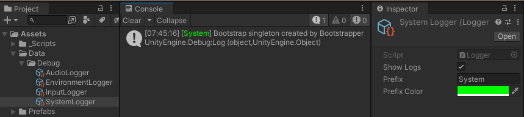
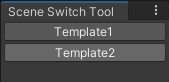

# Bootstrap

Bootstrap Project Overview
This project includes several tools and utilities designed to streamline development and improve organization within Unity.

-----

Contents:

1. Logger
The Logger provides a customized logging system to manage log messages in Unity. It facilitates better organization and filtering of log messages during development.

Functionality:

Supports different log types: Info, Warning, and Error.
Allows custom loggers with unique colors for easier identification.
Option to disable specific loggers to streamline debugging.
Usage:

Create instances of the Logger scriptable object via Create -> Logger -> New Logger.
Utilize Log, Warning, and Error methods within your scripts to manage log messages efficiently.

-----

2. Bootstrapper
The Bootstrapper initializes essential components before scene loading to maintain consistency across scenes and manage singletons or managers effectively.

Functionality:

Loads a Bootstrapper prefab from the Resources folder before any scene loads.
Ensures the necessary setup, such as singleton creation or manager attachment, before the game starts.
Usage:

Whatever needs to be initialized when the game starts can be attached as to the Bootstrap prefab. 
It gets loaded when the scene is loaded.

-----

3. Scene Switch Tool
The Scene Switch Tool offers a convenient way to manage and switch between different scenes within the project directly from the Unity Editor.

Functionality:

Fetches all scene files within the project.
Presents a window displaying available scenes and allows quick switching between them.
Usage:

Access the tool through Tools -> Scene Switch Window.
The window shows a list of scenes, allowing direct switching between them.

-----

Feel free to integrate these tools into your Unity projects as needed. For detailed instructions on usage, refer to the specific sections above for each tool's functionality and implementation details. Enjoy improved development efficiency and organization with these provided utilities!